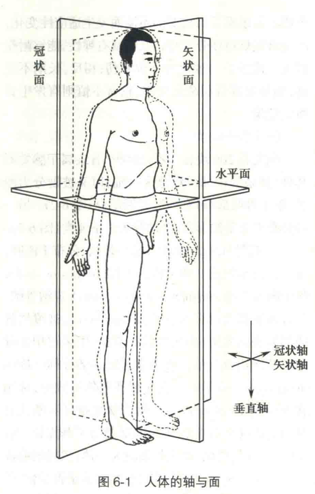

# 器官系统与整体

## 人体

### 人体的构造

- 形态与功能上相似或相关的细胞及其胞外基质构成组织。
- 人体由上皮组织、结缔组织、肌组织和神经组织等四大基本组织构成。
- 不同的组织按一定的规律有机组合形成具有特定功能和形态结构的功能单位，称为器官。
- 器官为了完成特定的生理功能，相互间协调配合组成具有特定形态结构和功能的器官集合体，称为系统。
- 人体器官从宏观上划分为九大系统：运动、呼吸、消化、泌尿、生殖、脉管、神经、内分泌和感觉器官。

### 人体的分部

- 头部

	- 颅部
	- 面部

- 颈部

	- 颈部
	- 项部

- 躯干部

	- 背部
	- 胸部
	- 腹部
	- 盆会阴部

- 四肢

	- 左、右上肢

		- 上肢带
		- 自由上肢

			- 臂
			- 前臂
			- 手

	- 左、右下肢

		- 下肢带
		- 自由下肢

			- 大腿
			- 小腿
			- 足

### 人体解剖姿势、方位术语及轴和面

- 人体的标准解剖姿势：标准姿势要求身体直立，面向前方，两眼平视正前方，两足并拢，足尖向前，双侧上肢下垂于躯干两侧，掌心向前。

- 方位术语

	- 上和下

		- 描述器官或结构相对颅顶或足底远近关系的术语。
		- 在标准解剖姿势下，近颅顶者为上，而近足底者为下。

	- 前（腹侧）与后（背侧）

		- 指在标准解剖姿势下，相对身体前、后面距离远近的术语。
		- 近身体腹侧面者为前，而近身体侧面者为后。

	- 内侧和外侧

		- 表述人体器官或结构与人体正中矢状面相对距离的术语。
		- 接近正中矢状面者为内侧，相反则为外侧。

	- 内和外

		- 描述空腔器官结构相对位置关系的术语。
		- 近腔结构为内，远腔结构为外。

	- 浅和深

		- 描述与体表皮肤相对距离关系的术语。
		- 接近皮肤者视为浅，远离皮肤而近人体颅、颈、躯干及四肢内部中心者为深。

	- 在四肢，把距肢体根部较近者称为近侧，较远者为远侧。

- 人体的轴和面

	

	- 轴
	
		- 垂直轴：上下方向与地平面相垂直的轴。
	- 矢状轴：前后（或腹背）方向与地平面相平行的轴。
		- 冠状轴：左右方向与水平面相平行的轴。

	- 面
	
		- 矢状面：前后（或腹背）方向将人体分成左、右两部的剖面。
		- 冠状面：左右方向将人体分为前、后两部的剖面。
		- 水平面（横切面）：为与地平面平行，将人体分为上、下两部的剖面。

### 人体器官的正常、变异和畸形

- 变异：部分个体的器官在形态、结构等方面与正常相比不完全相同，出现较小的差异，其在人群中所占比例小于正常，但这种差异不影响脏器发挥其生理功能。

## 运动系统

### 骨学

- 类型

	- 依据部位分类

		- 中轴骨

			- 颅骨
			- 躯干骨

		- 四肢骨

	- 依据形态分类

		- 长骨：呈长管状，分布于四肢，由一体两端构成。体又称为骨干（由骨密质构成），骨干内有空腔，称髓腔，容纳骨髓。长骨两端膨大部分被称为骺。
		- 短骨：形似立方体，多成群分布，相互间连结牢固且运动较灵活。
		- 扁骨：呈板状，基本构造为内、外两层骨密质板中间夹一层骨松质，被称板障。扁骨主要参与颅腔、胸腔和盆腔的构成，起保护作用。
		- 不规则骨：形状不规则。

- 骨的构造

	- 骨质

		- 类型（依据结构分类）

			- 骨密质：质地紧密，抗压抗扭曲性强，分布于骨的表面，构成所有骨的外壳。
			- 骨松质：呈多孔海绵状，由相互交织的骨小梁排列而成，分布于骨的内部。

	- 骨膜：除关节面外，骨的表面由较厚的致密结缔组织膜包裹，此为骨膜。骨膜富含血管、淋巴管及神经，对骨的新陈代谢和生长发育具有重要作用。在骨折的愈合过程中，骨膜对骨有修复、再生和改建的能力。一块剥除骨膜的骨无法存活。
	- 骨髓：骨髓腔和骨松质间隙充填的软组织。

		- 类型（依据组成成分和颜色分类）

			- 红骨髓：含有不同发育阶段的红细胞和其他幼稚型血细胞，有造血和免疫功能。
			- 黄骨髓：5岁后长骨骨髓腔内的红骨髓逐渐被脂肪组织代替，呈黄色，被称为黄骨髓，暂时失去造血能力。个体在慢性失血过多或重贫血等情况时，黄骨髓可转化为红骨髓，恢复造血功能。

### 关节学

- 骨连结的类型

	- 依据骨连结的运动特点分类

		- 不动连结
		- 微动连结
		- 动连结

	- 依据被连结骨间是否存在允许自由活动的间隙分类

		- 直接连结

			- 依据连结结构的不同分类

				- 纤维连结
				- 软骨连结
				- 骨性连结

		- 间接连结（关节/滑膜关节）

- 关节的基本结构

  - 关节面
    - 指各骨参与关节构成的相互接触的骨表面部分。
    - 骨的关节面上包被一层软骨，称为关节软骨。关节面被关节软骨覆盖。
    - 由于关节在至少两块骨间形成，所以每个关节至少有两个关节面，为了增加稳定性，关节面间多形成凹凸吻合的状态。凸关节面被称为关节头，凹关节面被称为关节窝。
  - 关节囊
    - 关节囊由纤维层和滑膜层构成。
    - 指由结缔组织膜构成的附着于关节面周缘的囊状结构。
    - 关节囊与骨膜相续连，由内、外两层构成。外层为致密结缔组织构成的纤维膜，纤维膜厚而结实，富含血管和神经，对关节起到很重要的保护作用。内层为薄的疏松结缔组织构成的滑膜，滑膜衬于纤维膜的内面，其边缘附着于关节软骨的周缘。
    - 滑膜血管供应丰富，具有良好的分泌和吸收功能，滑膜分泌的液体称为滑液。滑液是透明的液体，呈弱碱性，存在于关节腔内，对关节面起到润滑作用。
  - 关节腔
    - 指关节囊与关节面一起围成的封闭腔隙。该腔为一潜在性的腔隙，腔内无气体，呈负压状态，使得形成关节的两关节面紧密相贴，有利于关节的稳定，腔内仅含少量由滑膜分泌的滑液。
    - 关节囊因密闭形成负压。

- 关节的辅助结构

	- 韧带：为连于相邻两骨间的由致密纤维结缔组织构成的束状或膜状结构，具有加强关节的稳固或限制其过度运动的作用。

		- 类型（依据韧带所处位置在关节囊的内外两侧分类）

			- 囊外韧带
			- 囊内韧带

	- 关节内软骨

		- 存在形式

			- 关节盘：关节盘是属于胸锁关节特有的关节辅助结构。
			- 关节半月板：半月板属于膝关节的特有结构。
			- 关节唇：关节唇属于肩关节和髋关节的特有结构。

	- 滑膜囊和滑膜襞：多数情况下，关节囊的滑膜层表面积大于纤维层表面积，因此滑膜层折叠形成滑膜褶皱而突入关节腔，这些滑膜褶皱被称为滑膜襞。有些关节的滑膜层可突破纤维层呈囊状膨出，衬于肌腱与骨面之间减少肌肉活动时与骨面的摩擦，称为滑膜囊。

- 关节的运动

	- 屈和伸
	- 收和展
	- 旋转
	- 环转
	- 移动

- 关节的类型

	- 依据参与构成关节的骨数目分类

		- 单关节：指仅由两块骨构成的关节。
		- 复关节：三块或更多骨构成的关节。

	- 依据运动时涉及的关节数分类

		- 单动关节：指单个关节可独立运动。
		- 联动关节：指关节运动时必然牵涉其他关节同时运动。

	- 依据关节运动轴的数目并结合关节面的形态分类

		- 单轴关节
		- 双轴关节
		- 多轴关节

### 肌学

- 肌的类型（依据组织结构和功能分类）

	- 骨骼肌（横纹肌、随意肌）

		- 骨骼肌的构造和形态

			- 骨骼肌的构造

				- 肌腹：肌腹为肌性部分，由肌纤维（肌细胞）组成，具有收缩能力。
				- 肌腱：主要由平行致密的胶原纤维束构成，无收缩能力，但具有强大的抗张能力。

			- 骨骼肌的形态

		- 骨骼肌的起止及配布

			- 骨骼肌的起止点是相对的。
			- 骨骼肌呈拮抗配布。

		- 骨骼肌的辅助装置

			- 肌膜
			- 腱鞘
			- 籽骨和滑膜囊

	- 心肌（横纹肌、不随意肌）
	- 平滑肌（不随意肌）

- 肌细胞收缩的外部表现

	- 骨骼肌的收缩的外部表现

		- 等长收缩：肌肉收缩时若肌肉长度保持不变而只有张力增加，则为等长收缩。
		- 等张收缩：若收缩时只发生肌肉的缩短而张力保持不变，则为等张收缩。
		- 单收缩：当整块骨骼肌或单个肌细胞受到一次短促的刺激时，可发生一次动作电位，随后出现一次收缩和舒张，这一收缩过程称为单收缩。
		- 强直收缩：若给肌肉以连续的脉冲刺激，肌肉收缩情况将随刺激的频率而有不同。在刺激频率较低时，每一新的刺激到来前由前一次刺激引起的单收缩过程已经结束，于是每次刺激都引起一次独立的单收缩；当刺激频率增加时，后一次刺激有可能在前一次收缩的舒张期结束前即到达肌肉，于是肌肉在自身尚处于一定程度的缩短或张力存在的基础上进行的收缩，即在舒张期发生了收缩过程的复合，肌肉表现为不完全强直收缩。若刺激频率继续增加，那么肌肉就有可能在前一次收缩的收缩期结束前开始新的收缩，于是肌肉在收缩期发生了收缩过程的复合，表现为肌肉的完全强直收缩。

	- 影响骨骼肌细胞收缩的因素

		- 前负荷：使肌肉在收缩前就处于某种程度的被拉长状态，使它具有一定的长度，这称为初长度。实验表明，当初长度逐渐增大时，它每次收缩产生的主动张力也相应地增大，但在超过某一限度后，再增加初长度反而使主动张力减小，以致最后下降至零。这种能使肌肉收缩产生最大张力的初长度，称为最适初长度。
		- 后负荷：把肌肉的前负荷固定在它的最适前负荷，测定在不同后负荷情况下肌肉收缩产生的张力和缩短速度。实验表明，在有后负荷的条件下，肌肉产生的张力和缩短速度呈反比。
		- 肌肉的收缩能力：肌肉收缩能力是指与负荷无关的、决定肌肉收缩效能的内在特性。肌肉收缩特性主要取决于兴奋-收缩耦联期间胞质内钙离子的水平和肌球蛋白ATP酶的活性。

## 内脏学

### 内脏器官的分类和特点

- 类型（依据是否含有空腔分类）

	- 中空性器官：胃、肠、气管、膀胱、子宫等。
	  - 中空性器官管壁由外而内依次为外膜、肌层、黏膜下层和黏膜。
	- 实质性器官：肝、脾、肾等。
	  - 实质性器官有外膜包被，外膜通常会深入实质内将实质划分为叶、段等，实质性器官供血管、神经等结构出入的部位，被称为门。

### 胸部标志线和腹部分区

- 胸部标志线：胸部以肋骨作为天然的水平高度定位标志，结合9条垂直标志线进行脏器定位。

	- 前正中线：沿身体前面正中所做的垂线。
	- 胸骨线：沿胸骨侧缘最宽处所做的垂线。
	- 胸骨旁线：沿胸骨线与锁骨中线之间中点所做的垂线。
	- 锁骨中线：通过锁骨中点所做的垂线。
	- 腋前线：通过腋前襞所做的垂线。
	- 腋后线：通过腋后襞所做的垂线。
	- 腋中线：通过腋前、后线间的中点所做的垂线。
	- 肩胛线：通过肩胛骨下角所做的垂线。
	- 后正中线：沿身体后面正中所做的垂线。

- 腹部分区

	- 四分区：借助通过脐的水平线和垂线分区。

		- 左上腹区
		- 右上腹区
		- 左下腹区
		- 右下腹区

	- 九分区：利用人为规定的纵横线相结合进行区域划分，通常利用两条横线和两条纵线将腹部分为三部九区。

		- 纵横线将腹部划分为左、右侧区和中间区三区。左、右侧区又各自由上而下分为季肋区、外侧区（或腰区）和髂区（或腹股沟区）；中间区由上而下分为腹上区、脐区和腹下区。

		    - 上横线：通过两侧肋弓最低点的连线。
		    - 下横线：通过两侧髂结节的连线。
		    - 纵线：通过两侧腹股沟韧带中点的垂线。

### 消化系统

- 消化道

	- 上消化道：以十二指肠为界，包括口腔、咽、食管和胃及十二指肠本身构成上消化道。
	- 下消化道：空肠、回肠、盲肠、升结肠、横结肠、乙状结肠、直肠、肛管和肛门构成下消化道。

- 消化腺体

	- 肝是最大的消化腺体。

### 呼吸系统

- 呼吸道

	- 供气体进出肺的通道。
	- 组成

		- 上呼吸道：鼻、咽和喉构成上呼吸道。
		- 下呼吸道：气管和各级支气管称为下呼吸道。

- 肺

	- 气体交换的场所。
	- 组成

		- 实质组织
		- 间质组织

### 泌尿系统

- 功能

	- 负责机体代谢废物的排泄，维持机体的正常生理环境。
	- 肾脏通过肾素-血管紧张素-醛固酮系统对心血管系统的活动具有重要调节作用。

- 组成

	- 肾
	- 输尿管
	- 膀胱
	- 尿道

- 泌尿系统的描述

	- 尿液在肾脏生成，参与尿液暂时存储和排出的器官包括肾盂、输尿管、膀胱和尿道。
	- 过滤血液生成尿液的器官是肾。
	- 暂时存储尿液的器官是膀胱。
	- 兼具排尿和射精的器官是男性尿道。

### 生殖系统

- 组成

	- 内生殖器
	- 外生殖器

## 脉管系统

### 心血管系统

- 组成

	- 心

		- 心血管系统的动力源。
		- 心不停地收缩舒张为血液循环提供动力。

	- 动脉：为从心室发出负责将血液由心输送到外周脏器的血管。

		- 动脉在行程中不断分支，由大动脉分为中等动脉，再分为小动脉和细小动脉，越分越细，最后移行为毛细血管。

	- 毛细血管：连通动脉末梢（细小动脉）和细小静脉起始部的血管。

		- 毛细血管数量庞大，管壁很薄，具有良好的通透性，利于血液和细胞间液（组织液）间进行物质交换。
		- 毛细血管是负责完成血液与组织液间物质交换的血管。

	- 静脉：由毛细血管汇合而成的负责收集外周血液并运送血液回心的血管。

		- 静脉起始于毛细血管，由毛细血管首先汇集形成细小静脉，后者再汇集形成小静脉，如此逐渐汇合成中等静脉、大静脉，最后注入心房。

- 人体的血液循环

	- 体循环：起始于左心室，左心室内含营养物质和氧气丰富的动脉血进入人体最大动脉主动脉，经主动脉的各级分支将血液运输至各组织脏器，经毛细血管进行物质交换后动脉血转化为静脉血，后由细小静脉、小静脉等逐级汇聚最终经上腔静脉和下腔静脉回流至右心房。
	- 肺循环：起始于右心室，静脉血液由右心室进入肺动脉，经肺动脉的各级分支最终到达肺毛细血管网，在那里完成气体交换，血液转变为含氧丰富的动脉血，后经由肺内细小静脉、小静脉汇合形成肺静脉（左、右肺各有两条肺静脉）将动脉血运回左心房。

- 血管吻合

### 淋巴系统

- 组成

	- 淋巴管道
	- 淋巴组织
	- 淋巴器官

- 淋巴系统的描述

	- 脾属于淋巴系统。

### 脉管系统的描述

- 心脏具有两房两室。
- 肺循环起始于右心室，终于左心房。
- 体循环起始于左心室，终于右心房。
- 物质交换发生在毛细血管。
- 收集人体淋巴并最终汇入血管的是淋巴管。

## 感官、神经和内分泌

### 感受器和感觉器

### 神经系统

- 神经系统类型（依据分布部位区分）

	- 中枢部（中枢神经系统）

		- 中枢部的组成

			- 位于颅腔内的脑
			- 位于椎管内的脊髓

	- 周围部

		- 依据周围神经支配的对象划分

			- 躯体神经
			- 内脏神经

		- 依据周围神经功能差异划分

			- 感觉神经（传入神经）
			- 运动神经（传出神经）

- 神经系统主要由神经组织构成。

  - 神经组织的组成

  	- 神经细胞（神经元）：神经元是神经系统结构和功能的基本单位，具有传导神经冲动等诸多功能。
  	- 神经胶质细胞

- 神经系统的术语

	- 中枢性术语

		- 灰质：在中枢部，神经元胞体及其树突的聚集部位，在新鲜标本中色泽灰暗称为灰质。其中位于大脑和小脑表面的灰质又被称为皮质。
		- 神经核：形态和功能相似的神经元胞体在中枢聚集成团或柱被称为神经核。
		- 白质：神经纤维在中枢部聚集的部位，因髓鞘含类脂质色泽明亮而被命名为白质。其中位于大脑和小脑皮质深部的白质称为髓质。
		- 纤维束：白质中，起止、行程和功能基本相同的神经纤维聚集在一起被称为纤维束。

	- 周围性术语

		- 神经节：在周围部，神经元胞体聚集形成的结构称为神经节。
		- 神经：神经纤维在周围部聚集成条索状结构称为神经。

- 神经系统的分部情况

	- 按照分布部位，神经系统被划分为中枢部和周围部，二者在结构和功能上为一个整体。
	- 中枢部由位于颅腔内的脑和位于椎管内的脊髓两部分构成，称为中枢神经系统。
	- 周围部由与脑相连的脑神经和与脊髓相连的脊神经两部分组成，称为周围神经系统。
	- 周围神经根据支配对象不同，有划分为躯体神经和内脏神经。躯体神经分布于体表、骨、关节和骨骼肌等；内脏神经分布于内脏器官、心血管和腺体等。
	- 周围神经根据起功能差异可分为感觉神经和运动神经。感觉神经将来自周围感受器的神经冲动传入中枢，故称为传入神经；运动神经将来自中枢的神经冲动传出至周围的效应器，故称为传出神经。其中内脏神经中的传出神经（内脏运动神经），支配心肌、平滑肌和腺体，其活动不受人的主观意志控制，故称为自主神经，它由交感神经和副交感神经组成。

### 内分泌系统

- 内分泌系统的组成

	- 内分泌腺

		- 垂体
		- 甲状腺
		- 甲状旁腺
		- 肾上腺
		- 松果体

	- 内分泌组织

		- 以细胞团分散在机体的器官或组织内，如胰内的胰岛、睾丸内的间质细胞、卵巢内的卵泡和黄体等。

- 内分泌系统的描述

	- 内分泌系统由内分泌腺和内分泌组织构成。
	- 内分泌腺属于无管腺。
	- 内分泌系统激素量少，但作用大。
	- 垂体可分泌多种激素。
	- 胰腺是兼具内分泌和外分泌功能的器官。

